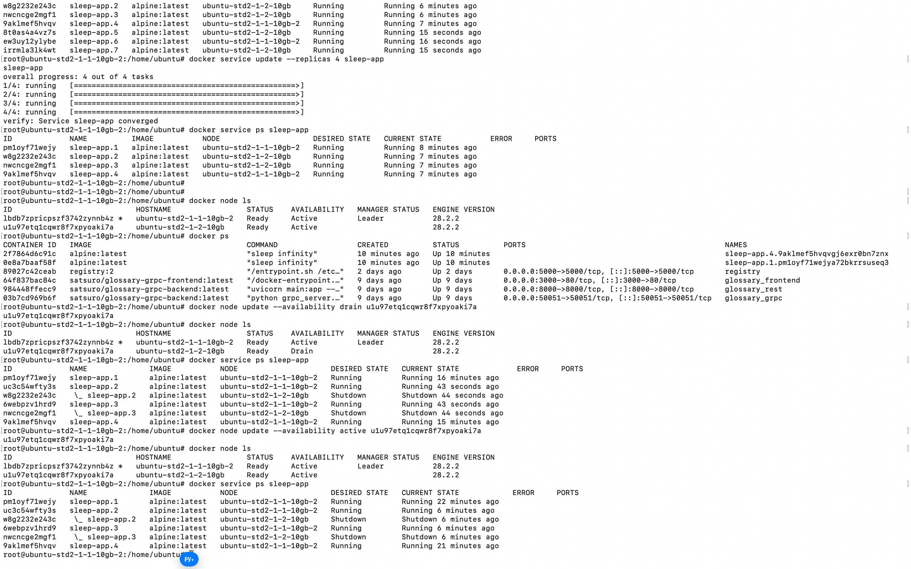

# Задание 6. Масштабирование приложений

Примечание - задания до 6.2 включительно выполнены локально, начиная с 6.3 на серверах linux (ubuntu)

## Содержимое registry после публикации образа hello-world


## Демонстрация неуспешной и успешной аутентификации и выполнения задания 2.3 


## Управление узлами в Docker Swarm (Active / Drain) задания 2.4

### Ответы на контрольные вопросы:

* Восстановилась ли работа запущенного сервиса на узле после возврата из состояния Drain в Active?
Нет. Автоматически запущенные задачи (контейнеры) не возвращаются на узел после его перевода обратно в состояние `Active`. Планировщик Swarm не перераспределяет текущие выполняемые задачи ради балансировки без явной команды, чтобы минимизировать прерывания в работе сервиса.

* Что необходимо сделать, чтобы запустить работу службы на этом узле снова?
Необходимо принудительно обновить сервис, чтобы планировщик заново распределил задачи с учетом новых доступных мощностей кластера. Это выполняется командой:
`docker service update --force <имя_сервиса>`. Альтернативный вариант — масштабирование сервиса (увеличение или уменьшение количества реплик командой `docker service scale`).

Демонстрация узлов в режиме Active и Drain




## Конфигурация Docker Stack и проверка жизнеспособности задания 2.5 

* Как конфигурируется количество нодов (реплик) в стэке:
Количество реплик задается в конфигурационном файле стэка (`docker-compose.yml`) внутри секции `deploy` с помощью параметра `replicas`

* Как организуется проверка жизнеспособности сервисов:

Проверка жизнеспособности настраивается в конфигурационном файле с помощью секции `healthcheck`. В ней задается выполняемая команда (например, `curl` или `ping`), а также параметры: `interval` (частота проверок), `timeout` (время ожидания ответа), `retries` (количество допустимых неудачных попыток) и `start_period` (время на инициализацию контейнера до начала проверок).

## Нагрузочное тестирование кластеризованного приложения

Для оценки изменения потенциала при обработке запросов было проведено нагрузочное тестирование с использованием утилиты ApacheBench (ab). Тестирование проводилось при параметрах: 2000 запросов (-n 2000) с уровнем конкурентности 50 (-c 50).

**Результаты тестирования:**

* 1 реплика (Flask):
Requests per second: 796.13 [#/sec].
Time per request: 62.804 [ms].

* 4 реплики (Flask):
Requests per second: 1124.69 [#/sec].
Time per request: 44.457 [ms].

**Вывод**
Потенциал при обработке запросов изменился в положительную сторону. Увеличение количества инстансов до 4 привело к росту пропускной способности (Requests per second) на 41.2% и соответствующему снижению среднего времени ответа (Time per request). Кластеризация успешно распределила нагрузку между узлами.

## Масштабирование сервиса БД (Redis)

Было проведено увеличение количества инстансов сервиса БД.

**Особенности работы реплицированного сервиса БД:**
При увеличении количества инстансов stateful-сервисов (таких как Redis) с помощью базового масштабирования Swarm возникает проблема потери консистентности данных. Каждый контейнер Redis запускается с изолированным хранилищем. Балансировщик нагрузки направляет запросы случайным инстансам, из-за чего счетчик приложения возвращает некорректные и рассинхронизированные данные.

**Пути разрешения**

1. Настройка Master-Slave репликации: Один инстанс настраивается исключительно на запись, остальные — на чтение с постоянной синхронизацией состояния от Master-узла.
2. Использование Redis Cluster: Настройка встроенного механизма шардирования и кластеризации Redis, который позволяет узлам обмениваться данными и поддерживать консистентность распределенной базы данных.

## Исследование применения Kubernetes

При переходе от Docker Swarm к Kubernetes для кластеризации изменятся следующие архитектурные подходы:

* Разделение абстракций: В Kubernetes функционал сервиса Swarm разделен на Deployment (отвечает за количество реплик, обновление и состояние подов) и Service (отвечает за сетевой доступ и балансировку трафика между подами).
* Сетевая модель: В Kubernetes каждый Pod получает собственный IP-адрес внутри кластера, тогда как в Swarm сервисы используют виртуальный IP-адрес (VIP).
* Управление конфигурацией: Запуск осуществляется через декларативные манифесты формата Kubernetes YAML, а не через docker-compose.yml.

## Конфигурация K8S

```yaml
apiVersion: v1
kind: Service
metadata:
  name: redis
spec:
  selector:
    app: redis
  ports:
    - protocol: TCP
      port: 6379
      targetPort: 6379

---
apiVersion: apps/v1
kind: Deployment
metadata:
  name: redis
spec:
  replicas: 1
  selector:
    matchLabels:
      app: redis
  template:
    metadata:
      labels:
        app: redis
    spec:
      containers:
        - name: redis
          image: redis:7-alpine
          ports:
            - containerPort: 6379
          volumeMounts:
            - name: redis-data
              mountPath: /data
      volumes:
        - name: redis-data
          emptyDir: {}

---
apiVersion: v1
kind: Service
metadata:
  name: counter-app
spec:
  selector:
    app: counter-app
  type: NodePort
  ports:
    - protocol: TCP
      port: 80
      targetPort: 5000
      nodePort: 30080

---
apiVersion: apps/v1
kind: Deployment
metadata:
  name: counter-app
spec:
  replicas: 4
  selector:
    matchLabels:
      app: counter-app
  template:
    metadata:
      labels:
        app: counter-app
    spec:
      containers:
        - name: counter-app
          image: satsuro/counter-app:latest
          ports:
            - containerPort: 5000
          env:
            - name: REDIS_HOST
              value: "redis"
```

## Конфигурация кластера (docker-compose.yml)

```yml
version: '3.8'

services:
  app:
    image: satsuro/counter-app:latest
    ports:
      - "80:8000"
    networks:
      - backend
    deploy:
      replicas: 4
      update_config:
        parallelism: 2
        delay: 10s
      restart_policy:
        condition: on-failure
    depends_on:
      - redis

  redis:
    image: redis:7-alpine
    command: ["redis-server", "--save", "60", "1", "--appendonly", "yes"]
    networks:
      - backend
    volumes:
      - redis_data:/data
    deploy:
      replicas: 1
      restart_policy:
        condition: on-failure

networks:
  backend:
    driver: overlay

volumes:
  redis_data:
```

