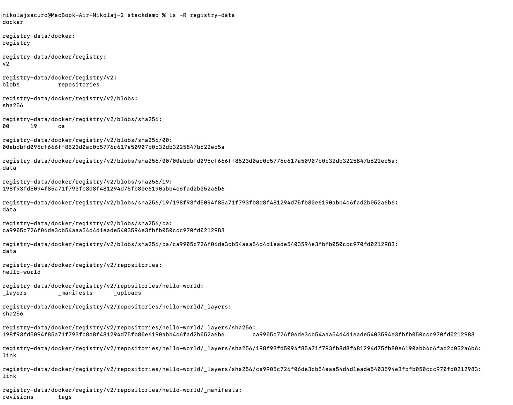
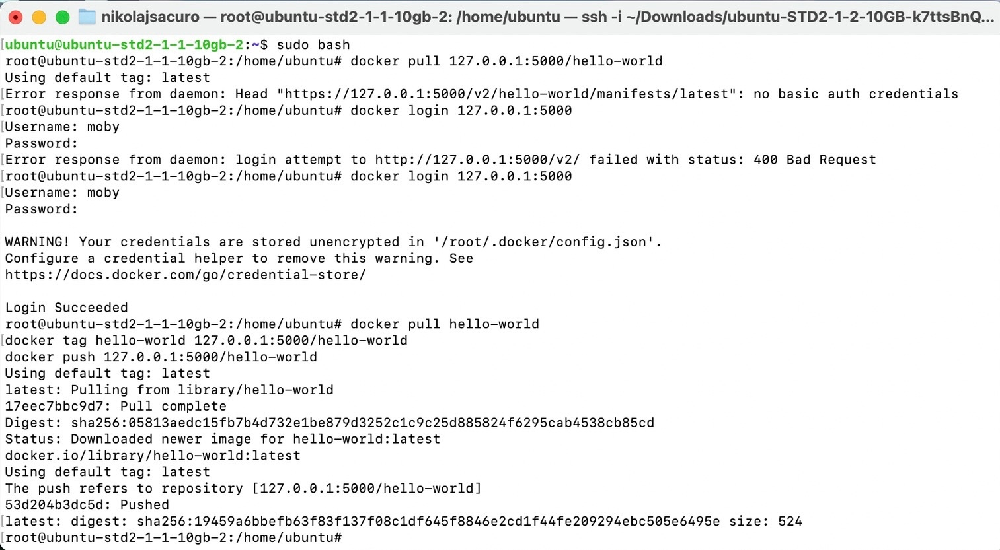

# Задание 6. Масштабирование приложений

Примечание - задания до 6.2 включительно выполнены локально, начиная с 6.3 на серверах linux (ubuntu)

## Содержимое registry после публикации образа hello-world

## Демонстрация нейспешной и успешной аутентификации и выполнения задания 2.3 

